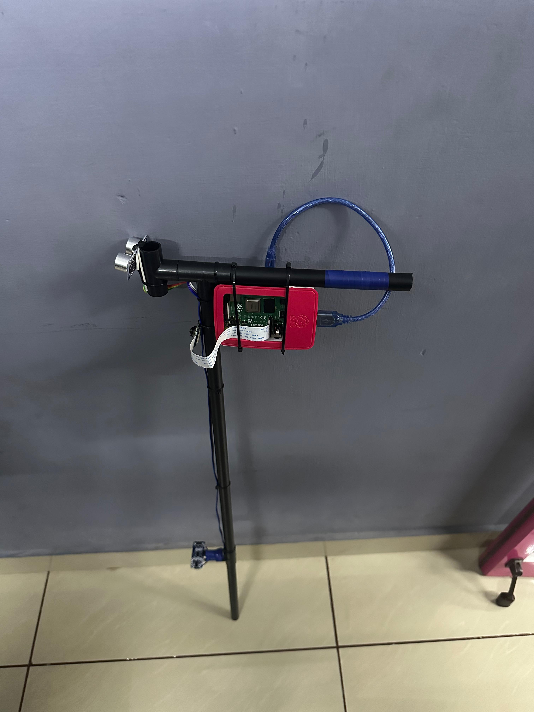

# Vision Aid Edge AI Object Detection System

## Overview
This project is a real-time Edge AI system that combines computer vision, IoT sensors, and Raspberry Pi to detect objects and monitor the environment.

The system uses a YOLOv8 deep learning model for object detection and ultrasonic sensors for distance measurement.

## Project Image

## System Architecture

Camera → Raspberry Pi → Flask Server → YOLOv8 Detection → Data Sent Back → Sensor Validation

## Components
- Raspberry Pi
- CSI Camera
- Ultrasonic Sensors
- YOLOv8
- Flask API
- OpenCV

## Features
- Real-time video streaming
- Object detection using deep learning
- Sensor-based validation
- IoT communication
- REST API integration

## How It Works

1. Raspberry Pi streams live video using Flask.
2. YOLOv8 model processes video frames.
3. Detected objects are identified.
4. Detection results are sent back to Raspberry Pi.
5. Ultrasonic sensors validate object distance.
6. System triggers response.

## Technologies Used
Python  
Flask  
OpenCV  
YOLOv8  
Arduino  
IoT Sensors

## Future Improvements
- Object tracking
- Web dashboard
- MQTT integration
- Cloud deployment
