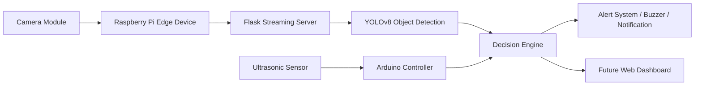

# Vision Aid Edge AI IoT System

An Edge AI system that combines computer vision, IoT sensors, and embedded devices to perform real-time object detection and environment monitoring.

This project demonstrates how AI models can run on edge devices like Raspberry Pi to enable smart and assistive systems without relying on cloud processing.

---

## Project Overview

The **Vision Aid Edge AI IoT System** integrates a camera module, Raspberry Pi, AI detection models, and ultrasonic sensors to build a real-time intelligent monitoring system.

The system captures live video, performs object detection using YOLOv8, and validates environmental conditions using IoT sensors before triggering actions or alerts.

This project demonstrates real-world skills in:

* Edge AI
* Computer Vision
* Embedded Systems
* IoT Architecture
* Backend API Development

---

## System Workflow

1. Camera captures real-time video.
2. Raspberry Pi streams video using a Flask server.
3. YOLOv8 AI model processes the video feed.
4. Objects are detected in real time.
5. Ultrasonic sensor checks object distance.
6. Decision engine analyzes results.
7. Alerts or actions are triggered.

---

## Architecture Diagram

---

## Project Structure

vision-aid-edge-ai-iot-system
│
├── README.md
├── requirements.txt
│
├── images
│   └── project_setup.jpg
│
├── raspberry_pi
│   └── server.py
│
├── ai_detection
│   └── detect.py
│
├── arduino
│   └── ultrasonic_sensor.ino

---

## Project Setup

Add your project image inside the **images folder**.

Example:

images/project_setup.jpg

Then it will automatically appear here:

---

## Technologies Used

Python
Raspberry Pi
Flask
YOLOv8
OpenCV
Arduino
Ultrasonic Sensors
REST API
Edge AI
IoT Systems

---

## Installation

Clone the repository

git clone https://github.com/your-username/vision-aid-edge-ai-iot-system.git

Move into project folder

cd vision-aid-edge-ai-iot-system

Install dependencies

pip install -r requirements.txt

---

## Running the Project

Start Raspberry Pi Streaming Server

python raspberry_pi/server.py

Start AI Detection

python ai_detection/detect.py

The system will start detecting objects from the camera stream.

---

## Hardware Requirements

Raspberry Pi (Recommended: Raspberry Pi 4)
Pi Camera Module or USB Camera
Arduino Board
Ultrasonic Sensor (HC-SR04)
Buzzer or Alert Module
Power Supply

---

## Features

Real-time video streaming
Edge AI object detection
IoT sensor integration
Modular system design
Low-latency local processing
Expandable architecture

---

## What Makes This Project Strong

This project demonstrates a complete Edge AI pipeline from hardware to AI decision-making.

Key strengths of this system:

1. Edge AI Processing
   Runs AI locally on Raspberry Pi instead of relying on cloud services.

2. Real-Time Computer Vision
   Live video streaming with object detection using YOLOv8.

3. Hardware + Software Integration
   Combines Raspberry Pi, Arduino, sensors, and AI models.

4. IoT Communication
   System components communicate through REST APIs.

5. Modular Architecture
   Each module is separated for scalability.

6. Real-World Problem Solving
   Designed for assistive vision and smart environment monitoring.

7. Scalable Design
   Easy to add more sensors or AI models.

8. Production-Like Workflow
   Structured repository similar to industry projects.

9. Edge Computing Implementation
   Reduces latency and improves privacy.

10. Expandable System
    Can be extended into smart city or smart home systems.

11. System Design Skills
    Demonstrates end-to-end AI system development.

12. Interview-Ready Project
    Covers multiple domains including:
    Computer Vision
    Embedded Systems
    IoT Systems
    AI Engineering
    Backend Development

---

## Future Improvements

Web dashboard for monitoring
Mobile app integration
Cloud data logging
MQTT-based communication
Object tracking system
Voice alert system

---

## Skills Demonstrated

Edge AI
Computer Vision
Deep Learning
Embedded Systems
IoT Architecture
REST API Development
System Design
Real-Time Processing

---

## Author

Abdulla Abdulraoof

GitHub: https://github.com/abdullaabdulraoof

---

## License

This project is open-source and available for learning and research purposes.
